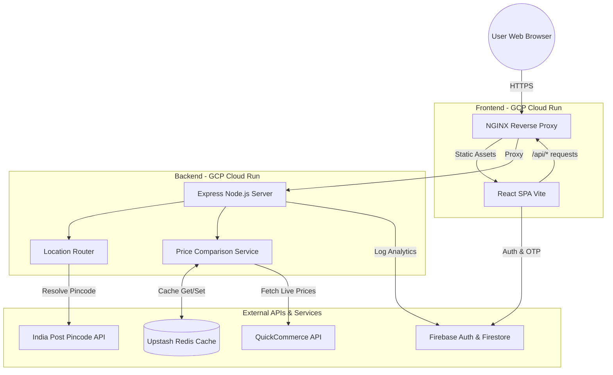

# GrocScan Architecture

This document outlines the high-level architecture and data flow of the GrocScan platform.

## System Flowchart

```mermaid
graph TD
    %% User Interfaces
    Client((User Web Browser))
    
    %% Frontend Layer (Cloud Run 1)
    subgraph Frontend [Frontend - GCP Cloud Run]
        React[React SPA Vite]
        Nginx[NGINX Reverse Proxy]
    end
    
    %% Backend Layer (Cloud Run 2)
    subgraph Backend [Backend - GCP Cloud Run]
        Express[Express Node.js Server]
        PriceSvc[Price Comparison Service]
        LocationSvc[Location Router]
    end
    
    %% External Services
    subgraph External [External APIs & Services]
        IndiaPost[India Post Pincode API]
        QCAPI[QuickCommerce API]
        Firebase[Firebase Auth & Firestore]
        Upstash[(Upstash Redis Cache)]
    end
    
    %% Connections
    Client -->|HTTPS| Nginx
    Nginx -->|Static Assets| React
    React -->|/api/* requests| Nginx
    Nginx -->|Proxy| Express
    
    Express --> LocationSvc
    Express --> PriceSvc
    
    LocationSvc -->|Resolve Pincode| IndiaPost
    PriceSvc <-->|Cache Get/Set| Upstash
    PriceSvc -->|Fetch Live Prices| QCAPI
    
    React -->|Auth & OTP| Firebase
    Express -->|Log Analytics| Firebase
```
